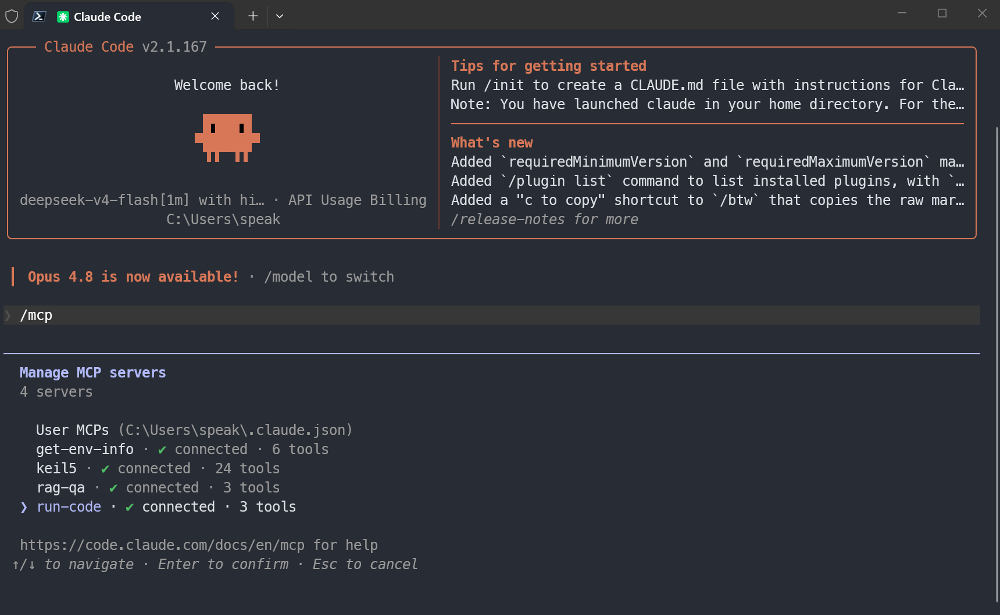

# AI-tool-calling

[English](README.md) | [简体中文](README_zh.md)

## 预览



9 个工具以 MCP 形式出现在 Claude Code 中，开箱即用。

极简工具调用框架。Tool Calling + MCP 双模式运行。

## 快速开始

```bash
npm install

# MCP 模式（不需要 API 密钥）— 配合 Claude Desktop、Claude Code 等使用
# .mcp.json 开箱即用

# Tool Calling 模式（需要 API 密钥）
cp config/config_example.json config/config.json
# 编辑 config/config.json — 填入 api_key、base_url、model
npx tsx index.ts "你的问题"
```

## 使用

```bash
npx tsx index.ts "当前目录有哪些文件"          # 只看答案
npx tsx index.ts --show_process "你的问题"     # 显示思考 + 工具调用
npx tsx index.ts --stream "斐波那契第30项"    # 流式输出
npx tsx index.ts --list_tools                 # 列出工具
```

| 参数 | 说明 |
| --- | --- |
| `question` | 你的问题 |
| `--show_process` | 显示思考过程、工具调用和结果 |
| `--stream` | 流式实时输出（自动启用 `--show_process`） |
| `--force_tool` | 强制 LLM 调用工具后再回答 |
| `--list_tools` | 列出可用工具并退出 |

## 配置

`config/config.json` 被 git 忽略，需从示例复制：

```bash
cp config/config_example.json config/config.json
```

| 字段 | 说明 | 示例 |
| --- | --- | --- |
| `api_key` | API 密钥 | `sk-xxx` |
| `base_url` | API 地址 | `https://api.deepseek.com` |
| `model` | 模型名称 | `deepseek-v4-flash` |

只有 Tool Calling 模式需要配置。MCP 模式不需要。

## MCP 模式

把工具注册为 MCP 服务器。不需要 API 密钥——MCP 客户端自己管理 LLM。

`.mcp.json` 开箱即用。可在任意 MCP 兼容客户端中使用（Claude Desktop、Claude Code 等）。

| Server | 工具 | 说明 |
| --- | --- | --- |
| `run-code` | `run_python`, `run_r`, `run_shell` | 沙箱执行代码 |
| `get-env-info` | `get_system_info`, `get_cpu_info`, `get_memory_info`, `get_disk_info`, `get_gpu_info`, `get_runtime_info` | 获取主机环境信息 |

## 添加工具

1. 在 `tools/` 下新建 `my_tool.ts`
2. 导入 `registerTool`（从 `./lib/registry.js`）并注册
3. 在 `tools/index.ts` 中添加 `import "./my_tool.js";`

详见 [tools/TOOL_GUIDE.md](tools/TOOL_GUIDE.md)。

## 构建

```bash
npm run build   # 编译到 dist/
npm run start   # 运行编译版本
npm run dev     # 监听模式（tsx）
```

## 项目结构

```text
AI-tool-calling/
├── index.ts                        CLI 入口
├── lib/
│   └── agent.ts                    LLM Agent
├── tools/
│   ├── index.ts                    barrel 导出
│   ├── get_*_info.ts               环境工具
│   ├── run_*.ts                    代码执行工具
│   └── lib/
│       ├── registry.ts             工具注册
│       ├── types.ts                共享类型
│       ├── errors.ts               SandboxError 类
│       └── env_helpers.ts          硬件查询 + 运行时检测
├── servers/
│   ├── get_env_info_server.ts      环境信息 MCP 服务器
│   └── run_code_server.ts          代码执行 MCP 服务器
├── tests/
│   ├── test_naming_convention.ts   文件命名检查
│   ├── test_direct_tools.ts        工具 handler 测试
│   ├── test_mcp_servers.ts         MCP 协议测试
│   ├── TEST_GUIDE.md               测试文档
│   └── tool_schema.json            命名规范 schema
├── config/
│   ├── config.json                 （git 忽略）
│   └── config_example.json
├── package.json
└── tsconfig.json
```
